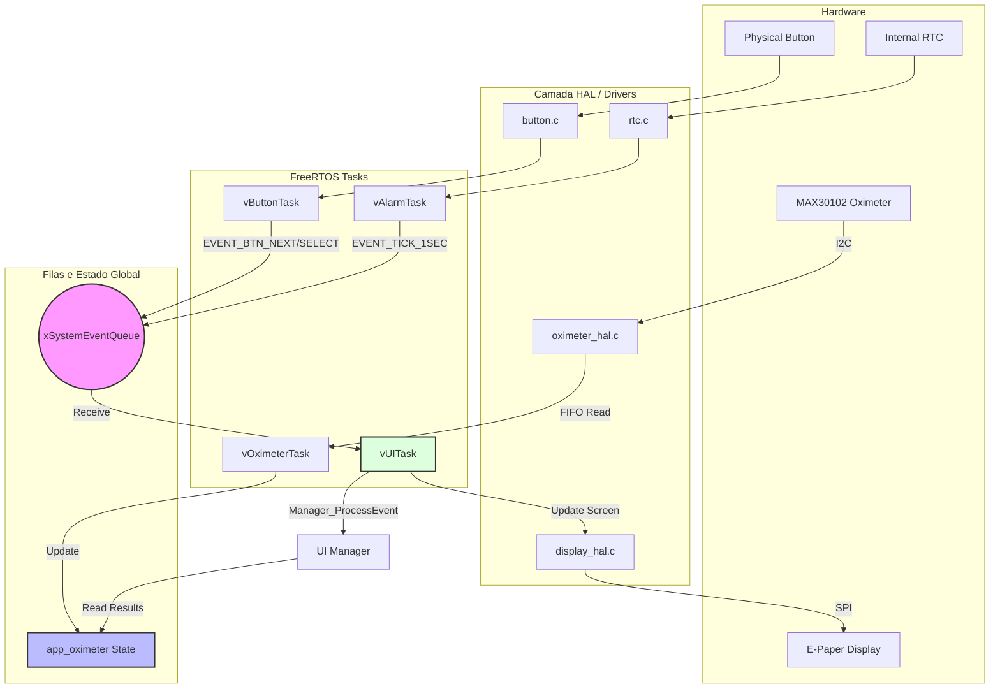

# Arquitetura do Sistema - E-Paper Watch FW

Este documento descreve a organização das tarefas, fluxos de dados e interações entre os componentes do sistema.

## Diagrama de Tarefas e Comunicação (Mermaid)

## Descrição das Camadas

1.  **Oximeter Flow**: A `vOximeterTask` faz o polling do sensor a 100Hz (via HAL), aplica os filtros CMSIS-DSP e atualiza o estado global de Heart Rate e SpO2.
2.  **Event Flow**: Botões e Alarme (via RTC) enviam eventos para a `xSystemEventQueue`.
3.  **UI Task**: É o consumidor central. Ela acorda quando recebe um evento, delega para o `UI_Manager` (que decide qual tela mostrar) e atualiza o display E-Paper.
4.  **Data Isolation**: As telas da UI não processam dados brutos; elas apenas consultam o estado processado pelo aplicativo de oximetria ou acelerômetro.
